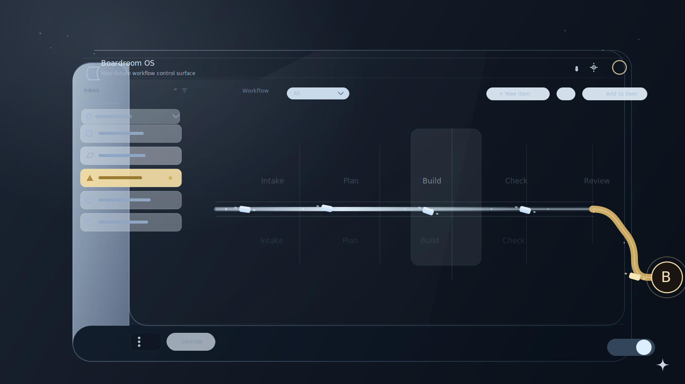

# Boardroom UI Visual Concept

## Status
- Approved direction for MVP frontend visual shell
- Date: 2026-04-01
- Scope: first-screen dashboard concept, workflow river, Board Gate reminder semantics

## Purpose

这份文档用于固化当前已确认的前端视觉方向。它不是新的产品边界文档，也不替代数据契约；它只回答一件事：

`Boardroom UI` 首页第一眼应该长什么样，以及它应该如何传达“ticket 在系统内流转，只有关键节点才升级到董事会”。

配套设计稿见：

- [assets/boardroom-ui-visual-draft-v2.svg](assets/boardroom-ui-visual-draft-v2.svg)

## Visual Thesis

首页应呈现为一块 `seamless dark-glass operating surface`：

- 深蓝黑色一体玻璃面板，而不是几张独立卡片拼接的后台
- 低饱和浅蓝色作为默认交互语义，而不是高对比霓虹蓝
- 发光采用 `soft feathered bloom`，像屏幕内部透出的冷光，而不是外部贴边灯带
- 首页主叙事不是表格、卡片或角色说明，而是 `workflow river`
- `ticket` 以光点和短光迹在河道中流转
- 进入董事会审批时，从蓝色主河道偏转到香槟金支路，并触发明确但克制的提醒

## What The First Screen Must Communicate

首页第一屏必须在不依赖大段文字的前提下，读出下面 4 件事：

1. 当前系统处于哪条主流程上
2. 哪些 ticket 正在流动，哪些节点正在执行
3. 是否出现了需要董事会介入的节点
4. `Inbox` 中有没有值得立即处理的提醒

如果第一屏需要靠阅读多段文字才能理解，就说明设计方向已经跑偏。

## Canonical Composition

当前确认版首页采用 `one glass slab + three functional zones`，但视觉上必须保持为一整块面，而不是三张并列卡片：

### 1. Top Chrome

- 很薄的一条顶栏
- 左侧只保留产品标识与极少量全局状态
- 右侧放通知、设置、Board 提醒灯
- 顶栏不承载复杂导航

### 2. Left Inbox Well

- 左侧为轻雾化浅蓝玻璃区
- 承载 `Inbox / Alerts`
- 每个列表项都应该优先通过 `形状 + 色带 + 状态点` 被识别
- 默认只保留一行简短信息，不允许在首页变成多行审计正文

### 3. Center Workflow River

- 中央是首页主舞台
- `Intake -> Plan -> Build -> Check -> Review` 不以厚重流程图框表达，而以嵌入式轨道和阶段腔体表达
- 当前激活节点可通过局部提亮、轻玻璃雾度和光轨汇聚感体现
- `ticket` 以小型浅蓝光点沿轨道移动，经过节点时留下轻微尾迹

### 4. Board Gate Branch

- 右侧不再使用巨大金门图标
- `Board Gate` 应被处理为一条从主河道偏出的香槟金支路，以及一个精确、优雅的圆形或光学框终点
- 金色只在 `board review required` 时出现，平时整个界面尽量保持蓝系单色

## Motion Language

首页默认动效应非常克制，只保留 3 种高价值运动：

1. `ticket drift`
   - 光点沿河道匀速前进
   - 速度平稳，不做花哨弹跳
2. `active stage bloom`
   - 当前阶段腔体轻微提亮
   - 只在 active / selected 时出现
3. `board reminder pulse`
   - 当 ticket 转入董事会审批支路时，顶部提醒灯、Inbox 金色条目、Board Gate 边缘同步做慢速呼吸

不应出现大面积循环呼吸、持续漂浮、重度景深、夸张镜头摇移。

## Color Semantics

当前确认的首页色彩语义如下：

- `pale blue / ice blue`: 默认控件、默认流转、选中但未告警
- `brighter cold blue`: 活跃 ticket、当前阶段、hover / focus
- `champagne gold`: 董事会审批支路与提醒
- `crimson / dark rose`: incident、breaker、故障态，仅限异常系统态使用

规则：

- 不允许让 `checker`、普通警告、普通 CTA 与 `Board Gate` 共用同一金色语义
- 不允许让正常流转与故障态共用红色语义

## What To Avoid

- 首页做成卡片瀑布流或 BI 仪表盘拼盘
- 靠大量说明文字解释功能，而不是靠布局和视觉语义
- 一上来展示 workforce 全员名册、人格雷达图或角色画廊
- 默认同时使用过多强调色
- 将董事会提醒设计成侵入式大弹窗
- 把首页做成“办公室动画”或“桌宠展示页”

## Relationship To Existing Docs

这份文档用于锁定视觉方向，与已有文档职责分工如下：

- [boardroom-ui-design.md](boardroom-ui-design.md)：产品边界、信息架构、前后端职责边界
- [boardroom-data-contracts.md](boardroom-data-contracts.md)：投影接口与命令契约
- [boardroom-ui-visual-spec.md](boardroom-ui-visual-spec.md)：这次视觉方向对应的详细实现规范

前端开发时，应先看这份文档，再进入详细视觉规范和数据契约。
