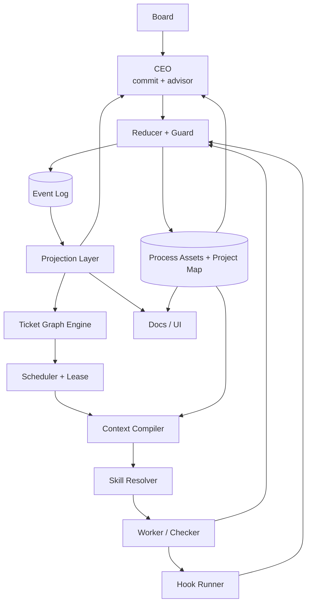
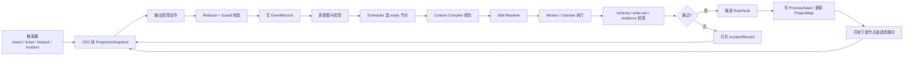
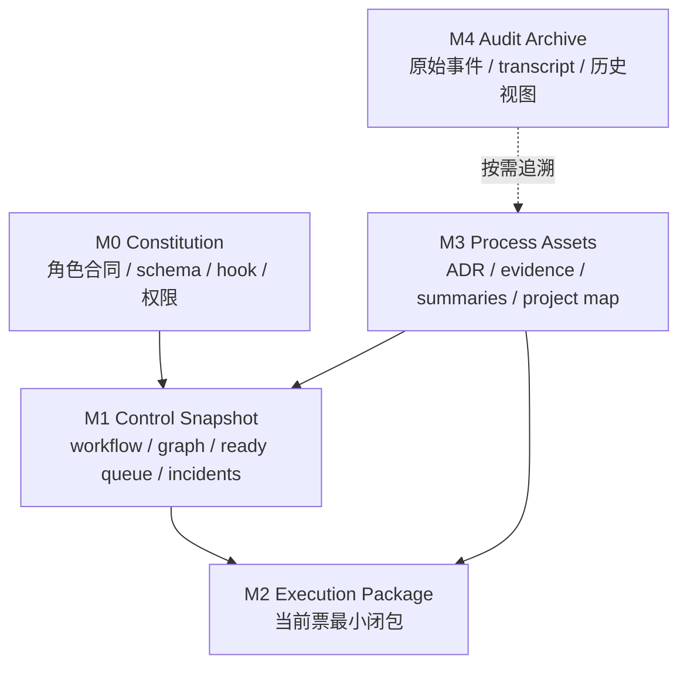
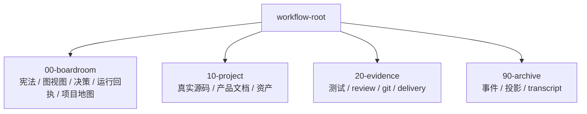

# 自治状态机总览

## TL;DR

这套新架构把系统真相收成三样东西：

- `EventRecord`
- `TicketNode / TicketEdge`
- `ProcessAsset`

文档、Dashboard、Review Room 都只是这三样东西的物化视图。  
CEO 不持有长对话记忆。Worker 不继承隐式上下文。错误不靠 fallback 掩盖，而是显式变成 `IncidentRecord`，再通过 `RecoveryAction` 幂等恢复。

## 设计目标

- 把系统从“流程会跑，但容易堆出文档地狱”收成“能收口、能重放、能复盘”的自治机。
- 把 CEO 从“上下文容器”收成“读快照、发受控动作的调度与顾问角色”。
- 把 Worker 从“看 prompt 猜边界”收成“拿执行包、按写集做事的无状态执行器”。
- 把 Board 从“一次性审批口”扩成“随时可唤醒的重规划顾问环”。
- 把文档从“记忆本体”降成“当前真相的可读视图”。

## 非目标

- 不把这套文稿写成当前代码现实。
- 不重开公网多租户、远程 worker 平台、对象存储扩展这些旧支线。
- 不把会议室、审计、Board UI 重新做成聊天系统。
- 不让 CEO、Worker、Checker 共享未建模的私有记忆。

## 核心 Contract

### 1. 系统真相

| 真相面 | 负责什么 | 不负责什么 |
|---|---|---|
| `EventRecord` | 记录发生过的动作和顺序 | 提供当前快照 |
| `TicketNode / TicketEdge` | 表达任务、依赖、替换、冻结、评审关系 | 保存大段正文 |
| `ProcessAsset` | 保存决策、证据、血缘、摘要、地图 | 直接驱动调度 |

### 2. 主要角色

| 角色 | 输入 | 输出 |
|---|---|---|
| `Board` | 审批包、顾问包、风险摘要 | 约束、裁决、重规划偏好 |
| `CEO` | `ProjectionSnapshot` + 资产摘要 | 受控动作、图补丁、顾问请求 |
| `Scheduler` | 图索引、租约、重试时间 | 可执行节点、执行顺序 |
| `Context Compiler` | 节点、资产、项目地图 | `CompiledExecutionPackage` |
| `Worker / Checker` | 执行包 | 结构化结果、资产引用、审查裁决 |
| `Hook Runner` | 事件、角色、交付类型 | 文档同步、证据留档、closeout |

### 3. 全局不变量

1. 所有正式协作都必须落成事件、图边、资产引用或审批记录。
2. 没有 `idempotency_key` 的动作不能执行。
3. 没有 `allowed_write_set` 的执行包不能发给 Worker。
4. 节点完成不等于下游可见。必须等必要 hook 和必要证据都落地。
5. 文档不直接驱动调度。调度只看投影、图和资产索引。
6. 任意恢复动作都必须可重放，且重放后不会额外制造副作用。

## 状态机 / 流程

### 系统架构图

### Runtime 流程图

### 记忆分层图

### 文档组织图谱

## 失败与恢复

- `Reducer` 拒绝动作时，不走静默 fallback，直接落 `IncidentRecord`。
- `Context Compiler` 组包失败时，不允许 Worker 带残缺上下文硬跑。
- Worker 写出不在 `allowed_write_set` 内的结果，按 `WRITE_SET_VIOLATION` 失败。
- 必要 hook 失败时，节点不对下游开放，只进入 `COMPLETED_PENDING_HOOKS` 语义。
- Board 长时间不响应时，冻结受影响子图，不冻结整个 workflow。

默认恢复动作只允许这几类：

- `RETRY_SAME_INPUT`
- `RECOMPILE_CONTEXT`
- `REASSIGN_EXECUTOR`
- `PATCH_GRAPH`
- `FREEZE_SUBGRAPH`
- `REQUEST_BOARD_ADVICE`

## 统一示例

`library_management_autopilot` 在新架构里会这样解释：

1. `project-init` 只生成 charter、治理起点和初始图。
2. 治理链跑完后，`backlog_recommendation` 不是生成一堆松散票，而是生成一版 `graph_version`。
3. `node_backend_catalog_build` 和 `node_frontend_library_build` 并发执行。
4. 任一 build 节点失败，都会生成 `IncidentRecord`，并冻结受影响分支。
5. `node_delivery_check` 只在 build 证据、文档同步、git closeout 都齐了才 ready。
6. Board 如果中途修改约束，CEO 开 `BoardAdvisorySession`，更新图而不是追加长文档说明。

## 和现有主线的关系

当前主线已经有这些基础：

- 事件日志
- 投影
- `ticket-result-submit`
- `CompiledExecutionPackage` 雏形
- `input_process_asset_refs[]`
- `Incident` 和 `Board Review` 路径
- `00-boardroom / 10-project / 20-evidence` 三分区

当前主线还缺这些关键拼块：

- 一等的 `versioned DAG`
- 和角色绑定的正式 hook 注册表
- CEO 的分层记忆预算和默认读面
- 技能运行时而不是“提示词时代的技能”
- `ProjectMap`
- 正式的 `BoardAdvisorySession`

所以这套新架构不是推翻现有主线，而是把现有零散能力收成一套单一协议。
