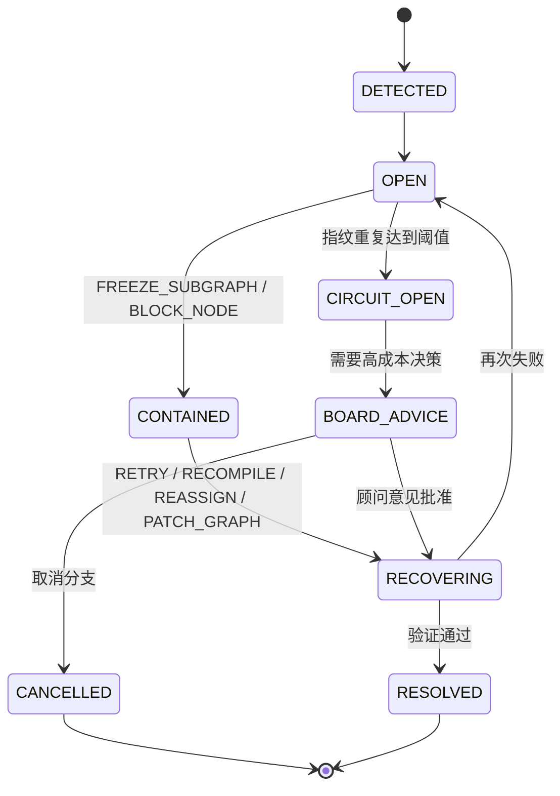

# Incident、幂等与恢复

## TL;DR

系统默认会出错。  
真正的区别不在于“能不能避免所有错误”，而在于：

- 错误会不会被看见
- 副作用会不会乱写
- 恢复能不能安全重放

这份规格把错误统一收成 `IncidentRecord`，把恢复统一收成 `RecoveryAction`，把幂等统一收成 `idempotency_key`。

## 设计目标

- 禁止用静默 fallback 掩盖真实失败。
- 让执行、图补丁、hook、顾问会话都能幂等重放。
- 让恢复动作成为正式协议，而不是临场补救。
- 把局部失败限制在局部分支，不让整条 workflow 跟着一起脏掉。

## 非目标

- 不追求“永不失败”。
- 不把所有错误都升级给 Board。
- 不允许人工口头解释代替结构化恢复动作。
- 不把 provider 不稳、上下文失真、写集越界这些问题混成一个大类。

## 核心 Contract

### 1. `IncidentRecord`

| 字段 | 含义 |
|---|---|
| `incident_id` | 事故标识 |
| `workflow_id` | 所属 workflow |
| `node_refs[]` | 受影响节点 |
| `incident_type` | 故障类型 |
| `severity` | 严重级别 |
| `fingerprint` | 去重指纹 |
| `opened_from_event` | 由哪个事件触发 |
| `containment_status` | 当前隔离状态 |
| `recommended_recovery_actions[]` | 推荐恢复动作 |
| `recovery_attempts[]` | 已执行恢复历史 |
| `board_escalation_required` | 是否需要顾问环 |

### 2. 故障分类

| `incident_type` | 说明 |
|---|---|
| `CONTRACT_VIOLATION` | schema、权限、状态机、角色合同不合法 |
| `WRITE_SET_VIOLATION` | 写到了未授权区域 |
| `EVIDENCE_GAP` | 代码有了，但证据、文档、git 没闭环 |
| `COMPILER_FAILURE` | 执行包无法生成 |
| `TOOL_FAILURE` | 工具执行失败 |
| `PROVIDER_OUTAGE` | 上游模型或 provider 不可用 |
| `DEPENDENCY_STALL` | 依赖长期不收敛 |
| `REVIEW_LOOP` | Maker-Checker 反复打架不收敛 |
| `GRAPH_THRASHING` | 图补丁反复重排但没有收敛 |
| `BOARD_POLICY_CONFLICT` | 董事会约束互相冲突 |

### 3. `RecoveryAction`

| 动作 | 作用 |
|---|---|
| `RETRY_SAME_INPUT` | 在原输入上重试 |
| `RECOMPILE_CONTEXT` | 重编译执行包 |
| `REASSIGN_EXECUTOR` | 换执行者 |
| `PATCH_GRAPH` | 修改图结构 |
| `FREEZE_SUBGRAPH` | 冻结受影响子图 |
| `RESUME_SUBGRAPH` | 解冻分支 |
| `REQUEST_BOARD_ADVICE` | 发起顾问会话 |
| `CANCEL_BRANCH` | 取消一条已不再值得恢复的分支 |

### 4. 幂等面

| 操作面 | 幂等键 |
|---|---|
| ticket 执行 | `workflow_id + ticket_id + attempt_no` |
| hook 执行 | `workflow_id + ticket_id + hook_id + hook_version` |
| 图补丁 | `workflow_id + graph_version + patch_hash` |
| 顾问会话 | `workflow_id + advisory_reason + source_version` |
| 资产物化 | `asset_type + source_ref + content_hash` |

没有幂等键的动作，一律不落执行链。

## 状态机 / 流程

### Incident / Recovery 状态图

### 恢复链规则

1. 先隔离，再恢复。不能一边污染主链一边试错。
2. 先选最小恢复动作，再选大动作。
3. 同一 `fingerprint` 超阈值后，禁止盲目重试，必须开熔断。
4. 需要人类裁量的恢复，统一升级为 `REQUEST_BOARD_ADVICE`。

## 失败与恢复

### 为什么禁止静默 fallback

静默 fallback 的问题不是“它不优雅”，而是它会破坏三件事：

- 把真实失败伪装成“成功但质量一般”
- 让审计线索断裂
- 让幂等恢复变成不可能

所以新架构的底线是：

- 可以降级，但降级必须显式记成 incident
- 可以换路径，但换路径必须有新的幂等键和新的事件
- 可以放弃某条分支，但必须显式 `CANCEL_BRANCH`

### 恢复优先级

默认恢复顺序固定为：

1. `RECOMPILE_CONTEXT`
2. `RETRY_SAME_INPUT`
3. `REASSIGN_EXECUTOR`
4. `PATCH_GRAPH`
5. `REQUEST_BOARD_ADVICE`
6. `CANCEL_BRANCH`

## 统一示例

在 `library_management_autopilot` 里，如果 `node_frontend_library_build` 连续三次只交出流程痕迹，没有真正源码：

1. 先记 `EVIDENCE_GAP`。
2. 冻结前端分支，后端分支继续。
3. 先尝试 `RECOMPILE_CONTEXT`，确认执行包里是否缺了文档和写集约束。
4. 还不收敛，就 `REASSIGN_EXECUTOR`。
5. 再不收敛，就开 `GRAPH_THRASHING` 或 `REVIEW_LOOP`，让 CEO 决定是换图还是开顾问环。

这条链里最重要的不是“最后怎么救”，而是系统不能假装它已经交付成功。

## 和现有主线的关系

当前主线已经有：

- `incident_projection`
- `CIRCUIT_BREAKER`
- provider 失败记录
- closeout / review / documentation gap 的局部治理

当前主线的缺口是：

- 幂等面还分散，很多动作没有统一键。
- fallback 还带有一定“自动帮你遮过去”的味道。
- incident 到 recovery 的协议还不够单一。

新架构就是把“报错、隔离、恢复、验证”收成一条正式主链。
