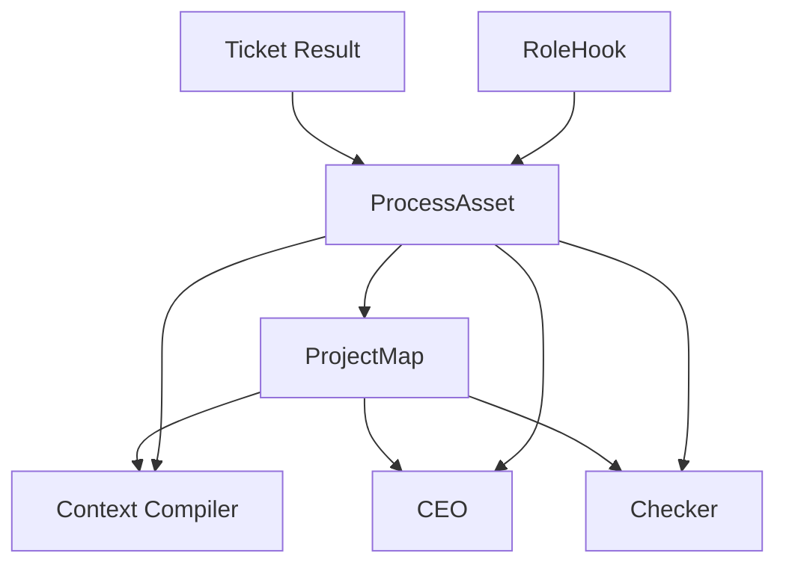

# 过程资产与项目地图

## TL;DR

如果没有一等的 `ProcessAsset` 和 `ProjectMap`，文档体系、CEO 记忆、Worker 上下文都会漂。  
因为系统永远会退化成：

- 文档很多
- 线索很多
- 但没人知道当前边界、责任和热点到底在哪

## 设计目标

- 把高价值中间成果收成可复用资产。
- 把项目边界、责任、热区、冲突区收成结构化地图。
- 让 `Context Compiler`、CEO、Checker 读的是资产和地图，不是散乱文档。
- 让失败经验和交付证据都能进入后续执行链，而不是留在归档角落。

## 非目标

- 不做全量知识库。
- 不把所有文件都硬塞进 `ProjectMap`。
- 不让项目地图替代真实代码和真实文档。
- 不让过程资产直接驱动调度。

## 核心 Contract

### 1. `ProcessAsset`

| 类型 | 说明 |
|---|---|
| `GOVERNANCE_DOCUMENT` | 正式治理文档 |
| `ADR` | 架构和策略决策 |
| `SOURCE_CODE_DELIVERY` | 源码交付结果 |
| `EVIDENCE_PACK` | 测试、截图、git、review 证据 |
| `FAILURE_FINGERPRINT` | 故障指纹和复盘结论 |
| `CLOSEOUT_SUMMARY` | 收口摘要 |
| `DECISION_SUMMARY` | 会议或顾问会话摘要 |
| `PROJECT_MAP_SLICE` | 地图切片 |

每条 `ProcessAsset` 至少要有：

- `asset_ref`
- `asset_type`
- `source_refs[]`
- `content_hash`
- `consumers[]`
- `supersedes_ref`
- `retention_policy`

### 2. `ProjectMap`

| 地图面 | 内容 |
|---|---|
| `ModuleBoundaryMap` | 模块边界和目录归属 |
| `InterfaceMap` | 关键接口和数据流 |
| `OwnershipMap` | 当前责任人和历史责任链 |
| `FailureHeatMap` | 哪些模块最容易出错 |
| `ConflictZoneMap` | 最容易返工、合流冲突、意见冲突的区域 |
| `DocumentSurfaceMap` | 哪类真实文档归谁维护 |
| `AssetLineageMap` | 资产血缘和消费链 |

### 3. 资产和地图的关系

- 资产是“发生过什么、产出了什么”。
- 地图是“这个项目现在长什么样、哪里危险、谁负责什么”。
- 地图由资产、事件和代码结构共同派生。

## 状态机 / 流程

### 项目地图 / 资产图

### 资产写回规则

1. 票完成后先写最小资产。
2. hook 再补证据、文档和地图相关资产。
3. 资产入索引后，地图刷新。
4. 后续票只消费资产引用和地图切片，不回看整段历史。

## 失败与恢复

| 失败 | 说明 | 恢复 |
|---|---|---|
| `ORPHAN_ASSET` | 资产没有消费者，也挂不到图上 | 标记并等待清理 |
| `STALE_PROJECT_MAP` | 地图版本落后于资产版本 | 触发地图刷新 |
| `OWNERSHIP_DRIFT` | 责任映射和真实执行链不一致 | 以最近成功交付链重建 |
| `EVIDENCE_LINEAGE_BREAK` | 证据包断了来源链 | 拒绝进入 closeout |

恢复原则：

- 地图是可重建视图，优先重算，不人工补字。
- 资产是正式交付物，错了就出新版本，不回改旧版。

## 统一示例

在 `library_management_autopilot` 里，`ProjectMap` 至少会暴露：

- backend catalog、frontend library、workflow 控制面这几个模块边界
- 哪些模块最近失败热度高
- 哪些目录最容易发生 merge / review 冲突
- 哪些治理文档正在影响当前 build

这样 `Context Compiler` 编译 `node_frontend_library_build` 时，不需要把一堆旧文档全塞进去，只需要读：

- 相关 `ADR`
- 相关 `FailureFingerprint`
- frontend 边界的 `ProjectMap` 切片

## 和现有主线的关系

当前主线已经有：

- `input_process_asset_refs[]`
- `produced_process_assets[]`
- 治理文档、meeting ADR、closeout summary 等过程资产

当前缺的是：

- 正式的 `ProjectMap`
- `FailureFingerprint` 的一等地位
- 资产血缘和地图刷新的一致协议

新架构补的，就是“让资产和地图成为真正的中间层”，而不是继续让长文档兜底。
