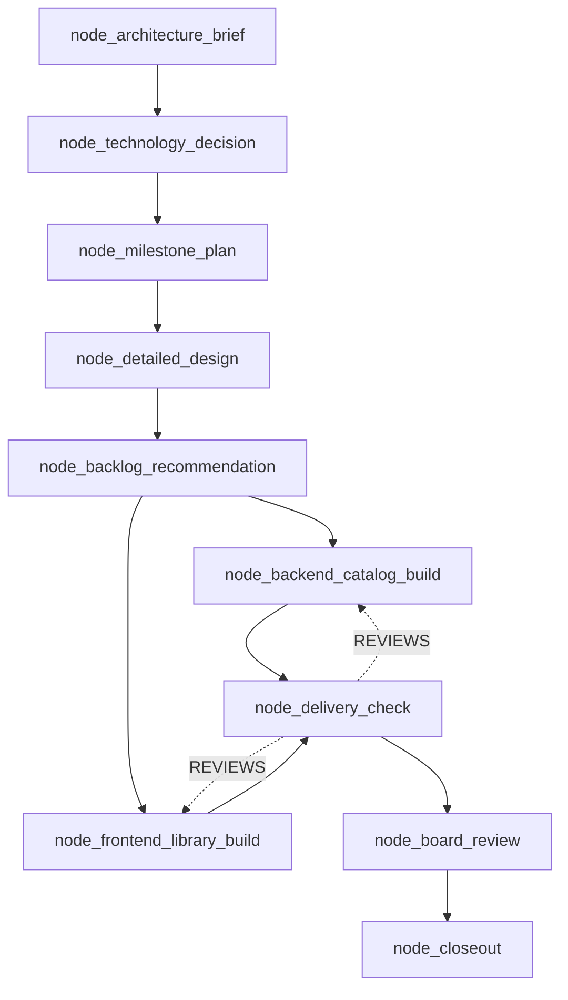
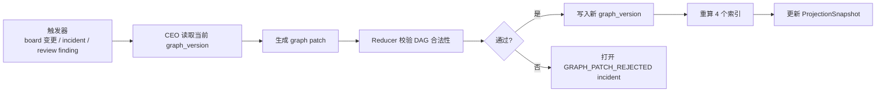

# Ticket 图引擎

## TL;DR

Ticket 真相不是树，是 `versioned DAG`。  
树只适合给人看，不适合表达 review、替代、冻结、返工、跨模块依赖这些真实关系。

图引擎负责三件事：

- 保存 `TicketNode` 和 `TicketEdge`
- 派生 `ready / hot dependency / critical path / failure heat` 索引
- 在约束变化或故障恢复时安全重组图

## 设计目标

- 把 CEO 拆出来的大量票据从“松散列表”收成稳定图结构。
- 在增删改 Ticket 时保持局部有序，不把全图重算成一锅粥。
- 支持并发实施、串行收口、局部冻结、局部替换。
- 让“当前最值得做的可执行节点”始终可计算。

## 非目标

- 不做通用图数据库。
- 不允许图引擎自行做业务判断，业务判断仍由 CEO 发动作。
- 不把每一条人类讨论都建成图节点。
- 不把全文文档正文塞进节点。

## 核心 Contract

### 1. `TicketNode`

| 字段 | 含义 |
|---|---|
| `node_id` | 图内稳定节点标识 |
| `ticket_id` | 当前版本节点绑定的执行票 |
| `workflow_id` | 所属 workflow |
| `graph_version` | 该节点所在图版本 |
| `node_kind` | `GOVERNANCE / IMPLEMENTATION / REVIEW / CLOSEOUT / INCIDENT / MEETING` |
| `deliverable_kind` | 交付类型 |
| `role_hint` | 建议执行角色 |
| `state` | 当前节点状态 |
| `priority_score` | 基础优先级 |
| `dependency_weight` | 被依赖权重 |
| `failure_heat` | 失败热度 |
| `idempotency_key` | 节点级幂等键 |

### 2. `TicketEdge`

| 边类型 | 含义 |
|---|---|
| `PARENT_OF` | 结构归属 |
| `DEPENDS_ON` | 执行依赖 |
| `REVIEWS` | 审查关系 |
| `REPLACES` | 新节点替换旧节点 |
| `FREEZES` | 某事件冻结某分支 |
| `DERIVES_CONTEXT_FROM` | 编译上下文依赖 |
| `ESCALATES_TO` | 升级到会议或董事会 |

### 3. 节点状态

| 状态 | 说明 |
|---|---|
| `PLANNED` | 已存在，但依赖未满足 |
| `READY` | 可租约、可执行 |
| `LEASED` | 已被执行器领取 |
| `EXECUTING` | 正在执行 |
| `WAITING_REVIEW` | Maker 完成，等 Checker 或 Board |
| `FROZEN` | 被 incident 或 board 冻结 |
| `BLOCKED` | 依赖、约束或证据不满足 |
| `COMPLETED` | 节点完成且已开放下游 |
| `FAILED` | 执行失败，待恢复动作 |
| `CANCELLED` | 节点被取消，不再恢复 |
| `SUPERSEDED` | 被新版本节点替换 |

### 4. 派生索引

| 索引 | 作用 | 排序因子 |
|---|---|---|
| `ReadyIndex` | 找当前可执行节点 | `priority_score + dependency_weight - failure_heat` |
| `DependencyHotIndex` | 找被依赖最多的关键节点 | 入边数、下游阻塞数 |
| `CriticalPathIndex` | 找收口主链 | 到 closeout 的最长剩余路径 |
| `FailureHeatIndex` | 找故障热点 | 错误频次、重试次数、返工轮次 |

图引擎只维护这些索引，不直接派单。派单还是 CEO 的事。

## 状态机 / 流程

### 示例图

### 图重组流程

### 图补丁规则

- 新增节点时必须显式声明父边和依赖边。
- 替换旧节点时必须写 `REPLACES` 边，旧节点转成 `SUPERSEDED`。
- 冻结某节点时，沿 `DEPENDS_ON` 传播到必要下游，不沿 `PARENT_OF` 全图乱冻。
- `graph_version` 一旦提交，不允许原地改边，只允许补丁生成新版本。
- 如果 `approval_mode` 要求专家把关，必须通过显式 `REVIEWS` / `ESCALATES_TO` 边表达，不能靠运行时暗规则临时拦截。

## 失败与恢复

### 典型失败

| 失败 | 说明 | 恢复 |
|---|---|---|
| cycle | 新边把 DAG 变成环 | 拒绝补丁 |
| orphan node | 节点没有父边也不在根集合 | 拒绝补丁 |
| stale patch | 基于旧 `graph_version` 打补丁 | 重新读取图再 patch |
| hot node thrash | 关键节点反复被替换 | 打开 `GRAPH_THRASHING` incident |
| freeze spread too wide | 冻结误伤无关分支 | 回滚补丁并限缩传播 |

### 恢复原则

- 任何图修改都必须能回溯到哪一次 Board 指令、哪一次 incident、哪一次 review finding。
- 局部返工优先，不允许一张票失败就把整棵树重建。
- 只有当结构已经不健康时，才允许 CEO 触发大范围 `PATCH_GRAPH`。

## 统一示例

`library_management_autopilot` 的老问题是：治理票、实现票、审查票很多，但关系主要藏在 follow-up 规则和文字说明里。  
新图引擎里它会明确表达：

- `node_backlog_recommendation` 是扇出点。
- `node_backend_catalog_build` 和 `node_frontend_library_build` 平级并发。
- `node_delivery_check` 同时依赖两个 build。
- 如果前端 build 连续失败三次，只冻结前端分支，不冻结后端分支。
- 如果 Board 中途要求“先做管理后台，再做访客借阅”，CEO 会打一个新 `graph_version`，重排 `ReadyIndex`。

## 和现有主线的关系

当前主线已经有：

- `ticket_id`
- follow-up 链
- staged `BUILD / CHECK / REVIEW / CLOSEOUT`
- 依赖 gate

当前主线还没有彻底一等化：

- review、replacement、freeze 这些关系还是散在多个协议里。
- 没有正式的 `graph_version`。
- “最优 ready 节点”更多是 controller 和 fallback 拼出来的，不是图索引直接算出来的。

新架构的图引擎就是把这些零散关系收成一张正式图。
