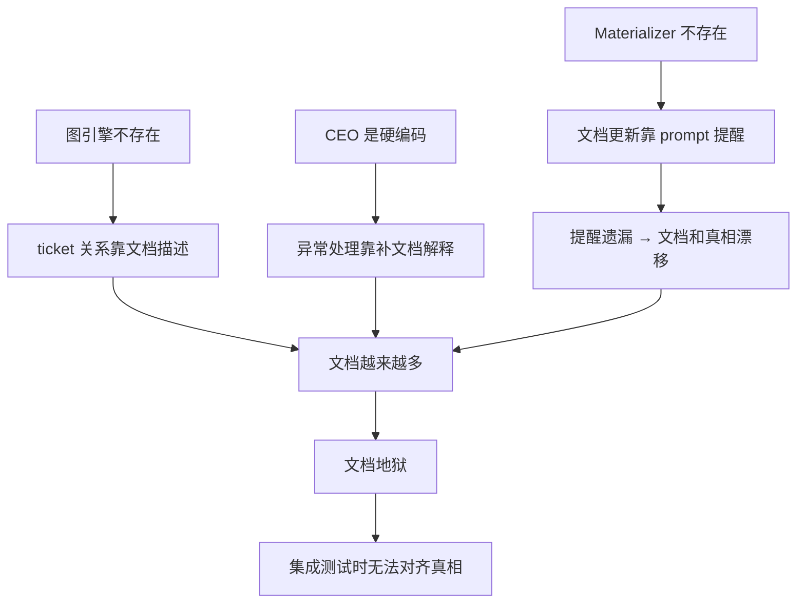
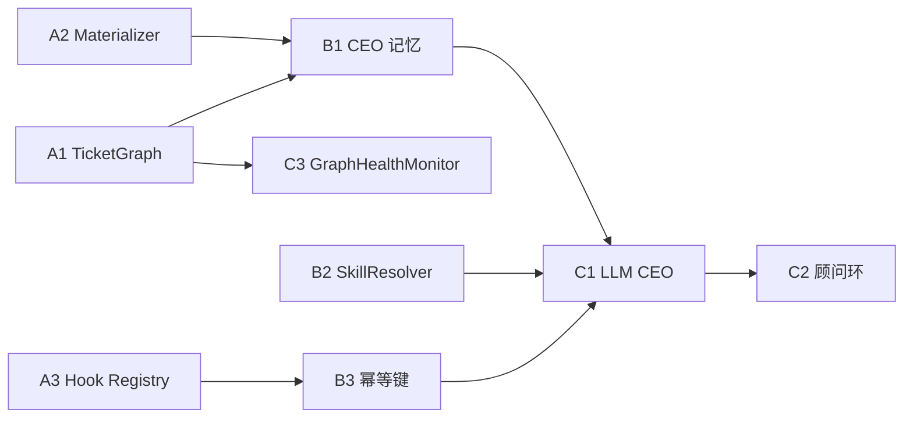

# 架构审计报告

## TL;DR

2026-04-13 对 `doc/new-architecture/` 全部 12 份规格和 `doc/archive/specs/feature-spec.md` 原始愿景（80 条）进行交叉审计。

结论：新架构设计质量高，和原始愿景对齐度约 85%。11 份子系统规格结构统一、职责清晰、失败模式考虑周全。核心问题不在设计本身，而在设计和实现之间的鸿沟——完美的公司大楼已经建好，但 CEO 还是硬编码状态机，Worker 还是 mock。

集成测试时落入"文档地狱"的根因有三个：

- `Document Materializer` 不存在，文档更新全靠 prompt 提醒
- CEO 是 `workflow_auto_advance.py` 硬编码，不能读快照做判断
- 图引擎不存在，ticket 关系散落在多个协议里

## 设计目标

- 留档：记录当前架构设计的优势、缺口和风险。
- 对齐：逐条验证新架构和原始愿景的对齐度。
- 定序：给出重构优先级建议。

## 非目标

- 不重新设计任何子系统。
- 不把审计结论当成新的实现文档。
- 不替代 `mainline-truth.md` 和 `roadmap-reset.md` 的职责。

## 核心 Contract

### 1. 审计维度与对齐度总表

| # | 原则 | 对应规格 | 对齐度 | 关键缺口 |
|---|------|---------|--------|---------|
| 1 | 文档体系固定骨架、固定格式、始终可读 | `01-document-constitution` | 95% | APPEND_LEDGER 膨胀控制缺规则 |
| 2 | Ticket 树自动重组，随时找最优可执行节点 | `02-ticket-graph-engine` | 90% | 缺 GraphHealthMonitor 自平衡检测 |
| 3 | Worker 无状态但必须分层注入上下文 | `03-worker-context-and-execution-package` | 95% | 基本完备 |
| 4 | CEO 分层记忆，不撑爆上下文 | `04-ceo-memory-model` | 90% | M2 生成策略不具体，缺遗忘协议 |
| 5 | 暴露错误、幂等恢复、禁止 fallback | `05-incident-idempotency-and-recovery` | 98% | 最完备的一份 |
| 6 | 标准化操作形成 hook，和角色挂钩 | `06-role-hook-system` | 85% | lifecycle_event 带阶段思维 |
| 7 | 技能是场景武器，不是人格属性 | `07-skill-runtime` | 95% | 缺技能组合兼容性矩阵 |
| 8 | CEO 是随时激活的顾问，能重规划 ticket 树 | `08-board-advisor-and-replanning` | 90% | 缺 Board 主动唤醒 CEO 的反向协议 |

### 2. 逐条审计细节

#### 第 1 条：文档体系

`01-document-constitution` 做对了：

- 固定目录骨架（`00-boardroom / 10-project / 20-evidence / 90-archive`）
- 四种更新模式（`REPLACE_VIEW / APPEND_LEDGER / VERSION_SUPERSEDE / IMMUTABLE_ARCHIVE`）
- 文档责任矩阵（谁能写什么）
- 禁止反向路径（人工编辑文档 → 系统推断状态）
- 文档可读性固定段落

缺口：

- `APPEND_LEDGER` 类文档（回执、证据、incident 记录）没有膨胀控制规则
- 需要分页/分卷规则：当 ledger 超过阈值时自动分卷，旧卷归档
- 需要摘要头部：每个 ledger 文档顶部维护自动生成的统计摘要

#### 第 2 条：Ticket 图引擎

`02-ticket-graph-engine` 做了正确决策：不是树，是 `versioned DAG`。四个派生索引直接回应了需求：

| 需求 | 对应索引 |
|------|---------|
| 随时找到被依赖最多的可执行任务 | `ReadyIndex`（priority + dependency_weight - failure_heat） |
| 自动重新组织 | `graph_version` + 补丁机制 |
| 健壮有序 | DAG 合法性校验（禁环、禁孤儿、版本冲突） |
| CEO 增删改时自动重组 | 图补丁 → Reducer 校验 → 重算 4 个索引 |

缺口：

- 没有显式的"再平衡"触发条件
- `DependencyHotIndex` 没有阈值告警
- 缺少"关键路径过长"的自动检测
- 需要 `GraphHealthMonitor`（见 `14-graph-health-monitor.md`）

#### 第 3 条：Worker 上下文分层

`03-worker-context-and-execution-package` 是最实用的一份。四层分层（`W0-W3`）和 `org_boundary` 设计完备。没有明显缺口。

#### 第 4 条：CEO 分层记忆

`04-ceo-memory-model` 的五层记忆（`M0-M4`）和上下文预算正确。

缺口：

- `M2 Replan Focus` 的生成策略需要量化：`failure_heat > threshold` 或 `blocked_duration > SLA` 的节点自动进入 M2
- 缺遗忘协议：超过 N 个唤醒周期未被引用的 M3 资产自动降级到 M4

#### 第 5 条：暴露错误、幂等恢复

`05-incident-idempotency-and-recovery` 是和原始愿景对齐度最高的一份。10 种故障分类、8 种恢复动作、5 个幂等面、固定恢复优先级。没有明显缺口。

#### 第 6 条：Hook 和角色挂钩

`06-role-hook-system` 核心设计正确：hook 绑定到 `role + lifecycle_event + deliverable_kind`。

缺口：

- `lifecycle_event` 的命名暗示了阶段思维（`PACKAGE_COMPILED`、`RESULT_ACCEPTED`）
- 更准确的触发条件应该是"角色 + 动作完成"的组合
- 建议将 `lifecycle_event` 重命名为 `trigger_action`

#### 第 7 条：技能是场景武器

`07-skill-runtime` 开篇就明确"技能不是员工人格的一部分"。`SkillResolutionPolicy` 的解析顺序正确，"角色只是过滤器"回应了需求。

缺口：

- 缺少技能组合兼容性矩阵（增强/冲突/中性的显式定义）

#### 第 8 条：CEO 作为随时激活的顾问

`08-board-advisor-and-replanning` 定义了 `BoardAdvisorySession` 和 6 种触发条件。

缺口：

- 缺 Board 主动唤醒 CEO 的反向协议（Board 要求 CEO 给出评估报告）
- 缺 `FULL_REPLAN` 动作类型（CEO 基于新约束从头重算整棵图的优先级）

### 3. "文档地狱"根因分析

#### 根因 1：Document Materializer 不存在

架构设计了 `EventRecord → ProjectionSnapshot → Document Materializer → 文档视图` 这条链，但代码里没有这个组件。文档更新全靠 prompt 提醒和人工维护。大模型注意力有限，提醒必然遗漏，遗漏导致文档和真相漂移，漂移导致补更多文档来解释差距——这就是文档地狱的正反馈回路。

#### 根因 2：CEO 是硬编码状态机

`workflow_auto_advance.py` 是确定性的，不能根据当前状态做判断。每次出问题只能靠补文档来解释"系统应该怎么做"，而不是让 CEO 自己读快照做决策。

#### 根因 3：图引擎不存在

没有 `versioned DAG`，就没有 `ReadyIndex`，就不能自动找最优节点，就只能靠文档记录"当前该做什么"——又回到文档地狱。ticket 关系散落在 follow-up 规则、文字说明和多个协议里，没有单一真相。

#### 根因回路图

## 状态机 / 流程

### 重构优先级

#### Phase A：建真相底座（打破文档地狱的根本）

| 序号 | 组件 | 作用 | 对应规格 |
|------|------|------|---------|
| A1 | `TicketGraph` | versioned DAG + 4 个派生索引 | `02` |
| A2 | `Document Materializer` | 从事件/图/资产自动生成文档视图 | `01` |
| A3 | `RoleHook Registry` | hook 正式注册、匹配、幂等执行 | `06` |

这三个做完，文档就不再是手工维护的真相，而是自动生成的视图。

#### Phase B：让 CEO 能工作

| 序号 | 组件 | 作用 | 对应规格 |
|------|------|------|---------|
| B1 | CEO M0-M4 记忆协议 | 读快照而不是翻文档 | `04` |
| B2 | `SkillResolver` | 技能运行时绑定 | `07` |
| B3 | 统一幂等键协议 | 所有操作可安全重放 | `05` |

#### Phase C：让系统自治

| 序号 | 组件 | 作用 | 对应规格 |
|------|------|------|---------|
| C1 | LLM 驱动的 CEO | 替换硬编码状态机 | `04` + `08` |
| C2 | `BoardAdvisorySession` | 顾问环 + 重规划 | `08` |
| C3 | `GraphHealthMonitor` | 图自平衡检测 | `14`（新增） |

### 重构顺序约束

## 失败与恢复

### 重构期最容易犯的错

| 错误 | 后果 | 纠偏 |
|------|------|------|
| 一边保旧 controller 一边补新图协议 | 双真相并存 | 强制单一 controller |
| 只补文档不补状态机 | 又回到文档地狱 | 先落 contract 再补读面 |
| 先补项目地图不补恢复协议 | 地图有了但系统还是乱恢复 | 先补 incident / hook |
| 用 fallback 兼容一切 | 真问题继续被遮住 | fail-closed + 显式 incident |
| 先做模式 UI 不立 GovernanceProfile | 后面接运行时要返工多层协议 | 先把 mode 收成合同 |

## 统一示例

`library_management_autopilot` 在审计后的验收口径：

- 图里能看见正式 fanout 和关键依赖，不再靠文字描述
- `source_code_delivery` 失败会开 incident，不会被 artifact JSON 混过去
- hook 会自动补文档、证据、git closeout，不靠 prompt 提醒
- Board 改约束时会生成 `BoardAdvisorySession` 和新图版本，不靠补长文档
- `closeout` 只在真实证据和真实资产齐全时打开

## 和现有主线的关系

本审计报告基于以下材料：

- `doc/archive/specs/feature-spec.md`（原始愿景 80 条）
- `doc/new-architecture/00-11`（新架构 12 份规格）
- `doc/mainline-truth.md`（当前代码真相）
- `doc/roadmap-reset.md`（当前阶段边界）

本报告不替代上述任何文档。它的作用是记录审计结论和重构建议，供后续拆任务时参考。

## 补充规格索引

本次审计建议新增两份规格：

- [13-cross-cutting-concerns.md](13-cross-cutting-concerns.md)：跨子系统的统一约定
- [14-graph-health-monitor.md](14-graph-health-monitor.md)：图自平衡检测
