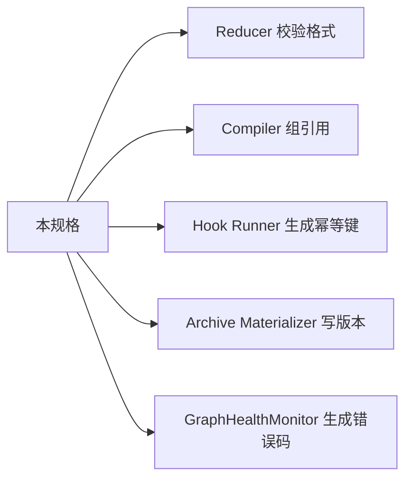

# 跨子系统统一约定

## TL;DR

幂等键怎么命名、版本号怎么编、错误码怎么分类、资产引用怎么写——这些约定散落在各份规格里。
如果不集中立法，每个子系统各自发明一套，迁移期会出现大量"格式对不上"的隐性故障。

## 设计目标

- 把跨子系统的命名、编码、引用、版本约定收成一份。
- 让 Reducer、Compiler、Hook Runner、Archive Materializer 消费同一套格式。
- 降低迁移期"各模块各自为政"的风险。

## 非目标

- 不在这里重复各子系统的业务逻辑。
- 不把这份约定做成 ORM 或代码生成器的输入。
- 不要求一次性把所有约定都实现。

## 核心 Contract

### 1. 幂等键命名规范

所有幂等键统一采用 `{scope}:{entity}:{discriminator}` 三段式。

| 操作面 | 幂等键模板 | 示例 |
|--------|-----------|------|
| ticket 执行 | `exec:{workflow_id}:{ticket_id}:{attempt_no}` | `exec:wf_001:tkt_042:3` |
| hook 执行 | `hook:{workflow_id}:{ticket_id}:{hook_id}:{hook_version}` | `hook:wf_001:tkt_042:git_closeout:1` |
| 图补丁 | `patch:{workflow_id}:{graph_version}:{patch_hash}` | `patch:wf_001:gv_007:a3b2c1` |
| 顾问会话 | `advisory:{workflow_id}:{trigger_type}:{source_version}` | `advisory:wf_001:CONSTRAINT_CHANGE:gv_007` |
| 资产物化 | `asset:{asset_type}:{source_ref}:{content_hash}` | `asset:ADR:tkt_042:f7e8d9` |

规则：

- 幂等键内不允许出现冒号以外的分隔符。
- `workflow_id`、`ticket_id`、`hook_id` 等标识符内部用下划线。
- 同一幂等键的第二次提交必须返回第一次的结果，不产生新事件。

### 2. 版本号全局约定

| 对象 | 版本格式 | 递增规则 |
|------|---------|---------|
| `graph_version` | `gv_{monotonic_int}` | 每次图补丁 +1 |
| `GovernanceProfile` | `gp_{monotonic_int}` | 每次模式变更 +1 |
| `ProcessAsset` | `{asset_ref}@{version_int}` | 每次 `VERSION_SUPERSEDE` +1 |
| `CompiledExecutionPackage` | `pkg_{ticket_id}_{attempt_no}` | 每次重编译生成新包 |
| `SkillBinding` | `sb_{ticket_id}_{binding_seq}` | 每次重绑定 +1 |
| `BoardAdvisorySession` | `bas_{workflow_id}_{session_seq}` | 每次新会话 +1 |

规则：

- 版本号只增不减。
- 旧版本不删除，只标记 `superseded_by`。
- 任何引用都必须带版本号，不允许"引用最新版"的隐式语义。

### 3. 错误码统一编码

错误码采用 `{domain}.{category}.{specific}` 三级结构。

| 域 | 类别 | 示例 |
|----|------|------|
| `graph` | `patch` | `graph.patch.cycle_detected` |
| `graph` | `patch` | `graph.patch.orphan_node` |
| `graph` | `health` | `graph.health.bottleneck_detected` |
| `exec` | `contract` | `exec.contract.schema_violation` |
| `exec` | `contract` | `exec.contract.write_set_violation` |
| `exec` | `evidence` | `exec.evidence.gap` |
| `hook` | `input` | `hook.input.missing` |
| `hook` | `write` | `hook.write.denied` |
| `hook` | `chain` | `hook.chain.timeout` |
| `ceo` | `memory` | `ceo.memory.overflow` |
| `ceo` | `replan` | `ceo.replan.loop_detected` |
| `skill` | `resolve` | `skill.resolve.not_found` |
| `skill` | `resolve` | `skill.resolve.conflict` |
| `board` | `advisory` | `board.advisory.timeout` |
| `board` | `advisory` | `board.advisory.spam` |
| `gov` | `profile` | `gov.profile.missing` |
| `gov` | `approval` | `gov.approval.scope_leak` |
| `doc` | `sync` | `doc.sync.view_stale` |
| `doc` | `ledger` | `doc.ledger.overflow` |

规则：

- 错误码全小写，用点号分隔。
- 每个错误码必须能映射到一个 `IncidentRecord.incident_type`。
- 新增错误码必须同时更新本表。

### 4. 资产引用格式

所有资产引用统一采用 `{asset_type}:{asset_ref}@{version}` 格式。

| 示例 | 含义 |
|------|------|
| `ADR:adr_tech_stack@2` | 技术选型 ADR 第 2 版 |
| `EVIDENCE_PACK:ep_tkt_042@1` | ticket 042 的证据包第 1 版 |
| `PROJECT_MAP_SLICE:pms_frontend@3` | 前端模块地图切片第 3 版 |
| `GOVERNANCE_DOCUMENT:gd_charter@1` | 项目章程第 1 版 |

规则：

- 引用必须完整，不允许省略版本号。
- 引用指向的资产必须存在，否则 Compiler 拒绝组包。
- 引用链断裂（指向已删除或未物化的资产）按 `exec.evidence.gap` 处理。

### 5. 时间戳格式

所有时间戳统一采用 ISO 8601 UTC 格式：`YYYY-MM-DDTHH:MM:SSZ`。

- 事件时间戳精确到秒。
- 租约超时、SLA 超时用秒数表示，不用时间戳。
- 人类可读文档中可以用本地时间，但结构化字段必须用 UTC。

### 6. 标识符命名规范

| 对象 | 前缀 | 示例 |
|------|------|------|
| workflow | `wf_` | `wf_lib_mgmt_001` |
| ticket | `tkt_` | `tkt_backend_build_042` |
| node | `node_` | `node_architecture_brief` |
| hook | `hk_` | `hk_git_closeout` |
| skill | `sk_` | `sk_debugging_core` |
| incident | `inc_` | `inc_evidence_gap_007` |
| advisory session | `bas_` | `bas_wf_001_003` |
| process asset | 按类型 | `adr_tech_stack`, `ep_tkt_042` |

规则：

- 标识符全小写，用下划线分隔。
- 标识符一旦分配不可回收。
- 标识符不编码业务语义（不靠解析标识符来推断类型，类型由字段表达）。

## 状态机 / 流程

跨子系统约定不直接驱动状态机。它的消费链是：

## 失败与恢复

| 失败 | 说明 | 恢复 |
|------|------|------|
| 幂等键格式不合法 | Reducer 拒绝 | 修正格式后重提交 |
| 引用指向不存在的资产 | Compiler 拒绝组包 | 补物化资产或修正引用 |
| 版本号不连续 | 写入时检测到跳号 | 检查是否有未提交的中间版本 |
| 错误码未注册 | 无法映射到 incident_type | 先注册错误码再使用 |

## 统一示例

`library_management_autopilot` 中一次 backend build 的幂等键和引用链：

- 执行幂等键：`exec:wf_lib_mgmt_001:tkt_backend_build_042:1`
- hook 幂等键：`hook:wf_lib_mgmt_001:tkt_backend_build_042:hk_git_closeout:1`
- 输入引用：`ADR:adr_tech_stack@2`, `PROJECT_MAP_SLICE:pms_backend@1`
- 输出资产：`SOURCE_CODE_DELIVERY:scd_tkt_042@1`, `EVIDENCE_PACK:ep_tkt_042@1`
- 图版本：`gv_12`（执行前）→ `gv_12`（执行后不变，只有补丁才递增）

## 和现有主线的关系

当前主线已经有部分约定散落在各处：

- `idempotency_key` 字段存在但格式不统一
- `artifact_ref` 存在但版本语义不一致
- 错误处理存在但没有统一编码

这份规格不发明新概念，只是把已有约定收成一张表。
