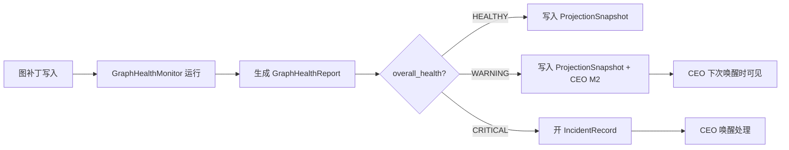
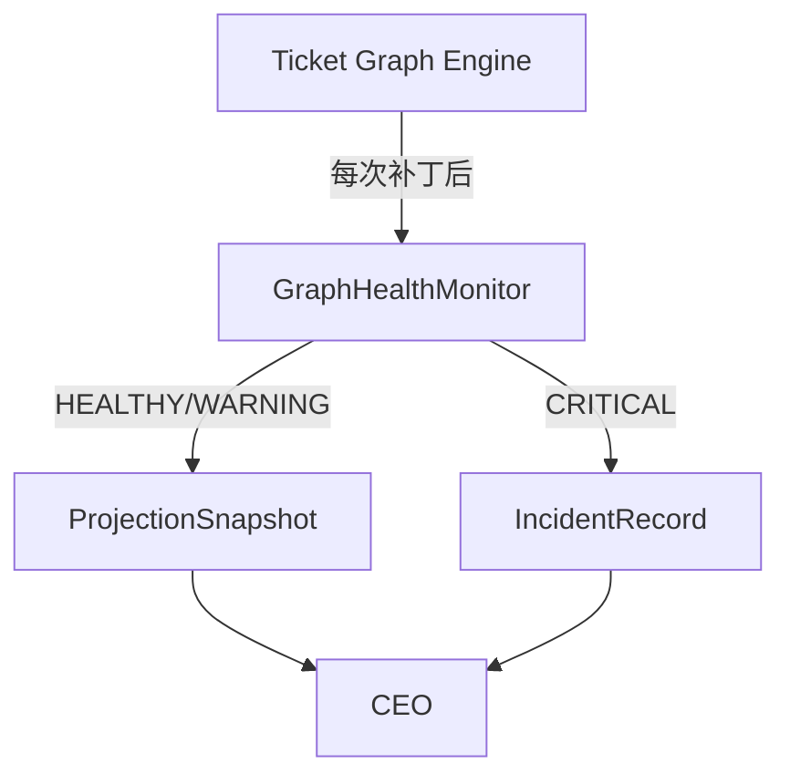

# 图健康监视器

## TL;DR

`02-ticket-graph-engine` 定义了 versioned DAG 和四个派生索引，但没有回答一个问题：**图什么时候算"不健康"？**

红黑树在插入删除后会旋转来保持平衡。DAG 没有旋转操作，但需要等价的自平衡机制：在每次图补丁后自动检测结构异常，生成告警或建议，让 CEO 知道该拆节点、该降深度、该清孤立分支。

`GraphHealthMonitor` 就是这个自平衡检测器。

## 设计目标

- 在每次图补丁后自动检测结构异常。
- 把"图已经不健康"从隐性感觉变成显式指标。
- 为 CEO 的重规划提供结构化输入，而不是让 CEO 凭印象判断。
- 把瓶颈、过深、过宽、孤立、震荡这些问题统一收成健康检查协议。

## 非目标

- 不替代 CEO 做业务判断。
- 不直接修改图结构。
- 不做通用图分析引擎。
- 不把健康检查做成阻塞操作。

## 核心 Contract

### 1. `GraphHealthReport`

| 字段 | 含义 |
|------|------|
| `report_id` | 报告标识 |
| `workflow_id` | 所属 workflow |
| `graph_version` | 检查时的图版本 |
| `timestamp` | 检查时间 |
| `findings[]` | 发现的异常列表 |
| `overall_health` | `HEALTHY / WARNING / CRITICAL` |
| `recommended_actions[]` | 建议的 CEO 动作 |

### 2. `HealthFinding`

| 字段 | 含义 |
|------|------|
| `finding_type` | 异常类型 |
| `severity` | `INFO / WARNING / CRITICAL` |
| `affected_nodes[]` | 受影响节点 |
| `metric_value` | 触发阈值的实际值 |
| `threshold` | 阈值 |
| `description` | 人类可读说明 |
| `suggested_action` | 建议动作 |

### 3. 检测维度

| 维度 | 检测内容 | 阈值建议 | 异常类型 |
|------|---------|---------|---------|
| 瓶颈检测 | 单节点被依赖数远超平均值 | 入边数 > 平均值 × 3 | `BOTTLENECK_DETECTED` |
| 深度检测 | 关键路径深度异常 | 到 closeout 的最长路径 > 15 层 | `CRITICAL_PATH_TOO_DEEP` |
| 扇出检测 | 单节点的直接子节点过多 | 出边数 > 10 | `FANOUT_TOO_WIDE` |
| 孤立检测 | 子图和主收口路径断开 | 无路径到任何 closeout 节点 | `ORPHAN_SUBGRAPH` |
| 震荡检测 | 同一区域反复被补丁 | 同一节点集在 N 个版本内被修改 > 3 次 | `GRAPH_THRASHING` |
| 冻结蔓延 | 冻结节点占比过高 | 冻结节点 > 总节点 × 30% | `FREEZE_SPREAD_TOO_WIDE` |
| 失败热区 | 某区域 failure_heat 持续升高 | failure_heat > 阈值且连续 3 个版本不降 | `PERSISTENT_FAILURE_ZONE` |
| 空转检测 | ready 节点长时间无人领取 | ready 状态持续 > SLA × 2 | `READY_NODE_STALE` |

### 4. 建议动作映射

| 异常类型 | 建议 CEO 动作 |
|---------|-------------|
| `BOTTLENECK_DETECTED` | 拆分瓶颈节点为多个并行子节点 |
| `CRITICAL_PATH_TOO_DEEP` | 合并低价值中间节点或并行化 |
| `FANOUT_TOO_WIDE` | 增加中间聚合节点 |
| `ORPHAN_SUBGRAPH` | 连接到主链或显式 `CANCEL_BRANCH` |
| `GRAPH_THRASHING` | 开 `BoardAdvisorySession` 稳定方向 |
| `FREEZE_SPREAD_TOO_WIDE` | 评估是否应该 `RESUME_SUBGRAPH` 或 `CANCEL_BRANCH` |
| `PERSISTENT_FAILURE_ZONE` | `REASSIGN_EXECUTOR` 或 `RECOMPILE_CONTEXT` |
| `READY_NODE_STALE` | 检查调度器是否卡死，或 CEO 是否遗漏 |

### 5. 触发时机

`GraphHealthMonitor` 在以下时机自动运行：

- 每次图补丁写入新 `graph_version` 后
- CEO 唤醒时作为 `M1 Control Snapshot` 的一部分
- 定时轮询（和 CEO 定时唤醒同频）

检查结果写入 `ProjectionSnapshot`，不写入 `EventRecord`（除非触发了 incident）。

## 状态机 / 流程

### 健康检查流程

### 和图引擎的关系

`GraphHealthMonitor` 只读图、只写报告。它不修改图，不派单，不做业务判断。

## 失败与恢复

| 失败 | 说明 | 恢复 |
|------|------|------|
| 检查超时 | 图规模过大导致检测慢 | 降级为只检查 WARNING 以上维度 |
| 阈值不合理 | 频繁误报或漏报 | 阈值应可配置，初期宽松后期收紧 |
| 报告和图版本不一致 | 检查期间图又被补丁 | 以检查时的 `graph_version` 为准，不追新版本 |
| CEO 忽略 WARNING | 问题持续恶化 | WARNING 持续 N 个版本后自动升级为 CRITICAL |

恢复原则：

- 健康检查本身不能成为阻塞点。检查失败时降级，不阻塞图补丁。
- 阈值是建议值，不是硬限制。CEO 可以在顾问环中调整阈值。
- CRITICAL 必须开 incident，不允许静默忽略。

## 统一示例

`library_management_autopilot` 中，如果 `node_backlog_recommendation` 一次扇出了 12 个 build 节点：

1. `GraphHealthMonitor` 检测到 `FANOUT_TOO_WIDE`（出边数 12 > 阈值 10）。
2. 生成 WARNING 级别的 `GraphHealthReport`。
3. 报告写入 `ProjectionSnapshot`，CEO 下次唤醒时在 M1 中看到。
4. CEO 可以选择：增加中间聚合节点（按模块分组），或判断 12 个并发是合理的并标记为已知。

如果 `node_frontend_library_build` 连续 3 个图版本 `failure_heat` 持续升高：

1. `GraphHealthMonitor` 检测到 `PERSISTENT_FAILURE_ZONE`。
2. 生成 CRITICAL 级别报告。
3. 自动开 `IncidentRecord`。
4. CEO 被唤醒，决定 `REASSIGN_EXECUTOR` 或 `RECOMPILE_CONTEXT`。

## 和现有主线的关系

当前主线已经有：

- `FailureHeatIndex`（在图引擎规格中定义）
- `circuit_breaker`（在 incident 规格中定义）
- `DependencyHotIndex`（在图引擎规格中定义）

当前缺的是：

- 把这些分散的指标收成一次性健康检查
- 瓶颈、深度、扇出、孤立、震荡的显式检测
- WARNING 到 CRITICAL 的自动升级协议
- 健康报告进入 CEO 读面的正式通道

`GraphHealthMonitor` 就是图引擎的"自平衡检测层"——它不旋转节点，但它告诉 CEO 什么时候该动手术。
